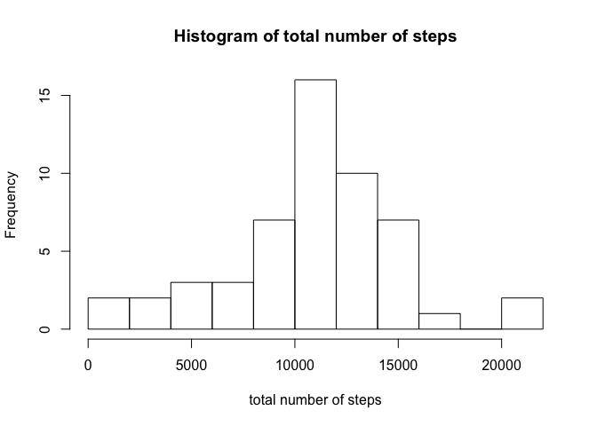
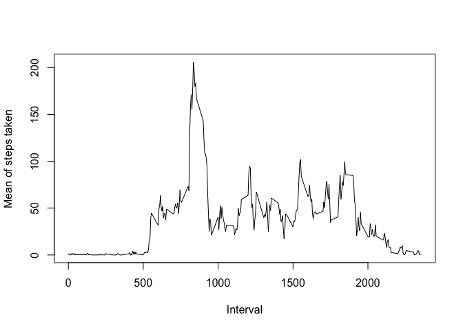
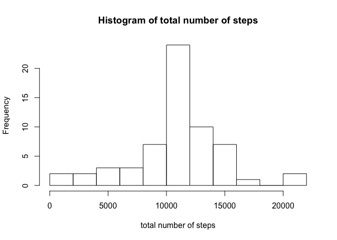
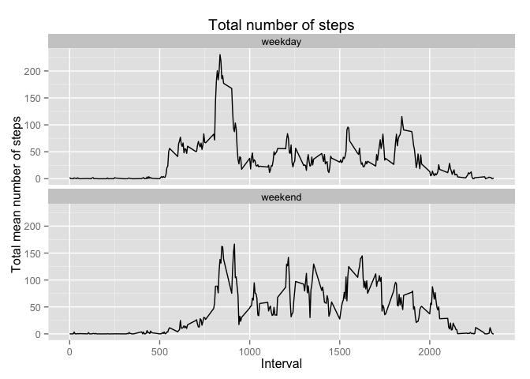

# Reproducible Research: Peer Assessment 1


## Loading and preprocessing the data

Unzip the data if csv file is not available

```r
if(!file.exists("activity.csv")) unzip("activity.zip")
```

1. Load the data from csv file:

```r
activity = read.csv("activity.csv")
```

2. Parse the date using lubridate package

```r
require(lubridate)
activity$date = ymd(activity$date)
```

## What is mean total number of steps taken per day?
1. Using dplyr package, group the activity dataset by date variable

```r
require(dplyr)
activity_date <- group_by(activity,date)
```

2. Summarize the data by taking the sum of steps for each day and plot a histogram of the total number of steps per day

```r
activity_date <- summarize(activity_date,total = sum(steps))
hist(activity_date$total,breaks = 10,xlab = "total number of steps",main="Histogram of total number of steps")
```

 


3. Mean of number of steps taken per day

```r
mean.date <- mean(activity_date$total,na.rm=TRUE)
```

```
## [1] 10766.19
```

4. Median of number of steps taken per day

```r
median.date <- median(activity_date$total,na.rm=TRUE)
```

```
## [1] 10765
```

## What is the average daily activity pattern?
Now, summarize data by interval variable and calculate the mean for each interval for all days. Again, using dplyr. Then, the resulting data ins plotted. 

```r
activity_int <- group_by(activity,interval)
activity_int <- summarize(activity_int,mean = mean(steps,na.rm=TRUE))
plot(activity_int$interval,activity_int$mean,type="l",xlab = "Interval",ylab = "Mean of steps taken")
```

 

Calculating the maximum mean of steps taken and in which interval it is assigned.

```r
maximum.steps <- max(activity_int$mean)
interval.max <- activity_int$interval[which.max(activity_int$mean)]
```
The maximum number the steps taken in an interval was 206.1698113 in the interval identified by 835. 

## Imputing missing values
1. The number of missing values in the activity dataset is 2304.

2. First, Duplicating the dataset.

```r
activity.imputed <- activity
```

The strategy adopted for filling NA values is to use the mean for respective interval averaged for all days. First, determine the NA rows in dataset and the respective intervals in these rows.

```r
na.rows <- which(is.na(activity.imputed$steps))
na.intervals <- activity.imputed[na.rows,3]
na.intervals.mean <- activity_int[match(na.intervals,activity_int$interval),2]
```

Now, imput the mean values in the new database

```r
activity.imputed[na.rows,1] <- na.intervals.mean
```

3. First, grouping dy date and summarizing the imputed dataset by adding it all

```r
activity.imputed_date <- group_by(activity.imputed,date)
activity.imputed_date <- summarize(activity.imputed_date,total = sum(steps))
hist(activity.imputed_date$total,breaks = 10,xlab = "total number of steps",main="Histogram of total number of steps")
```

 

The mean of imputed dataset is: 

```r
mean.imputed.date <- mean(activity.imputed_date$total)
```

```
## [1] 10766.19
```

and the median is:

```r
median.imputed.date <- median(activity.imputed_date$total)
```

```
## [1] 10766.19
```

The imputed mean differs 0% from the original value. And the median differs -0.0110421%.

## Are there differences in activity patterns between weekdays and weekends?
1. First of all, setting language to assure that weekdays are returned in English.

```r
Sys.setlocale("LC_TIME", "en_US.UTF-8")
```
Set default value of the column weekday to "weekday". Using dplyr

```r
activity.imputed <- mutate(activity.imputed,weekday = "weekday")
```
Now, setting weekend to "weekend" and creating a factor of this column

```r
activity.imputed[weekdays(activity.imputed$date,abbreviate = TRUE)=="Sat" | weekdays(activity.imputed$date,abbreviate = TRUE)=="Sun",4] <- "weekend"
activity.imputed$weekday <- as.factor(activity.imputed$weekday)
```

2. Grouping the dataset in interval and weekdays. Hence, summarizing by mean of steps taken

```r
activity.imputed_int <- group_by(activity.imputed,interval,weekday)
activity.imputed_int <- summarize(activity.imputed_int,mean = mean(steps))
```
Plot dividing in two panels according to weekday

```r
require(ggplot2)
g <- ggplot(activity.imputed_int, aes(interval, mean))
g <- g + 
  geom_line() + # Adding points
  facet_wrap( ~ weekday, ncol = 1) + # Panels by type
  labs(x = "Interval") + # X label
  labs(y = "Total mean number of steps") + # Y label
  labs(title = "Total number of steps") # Title

print(g)
```

 
